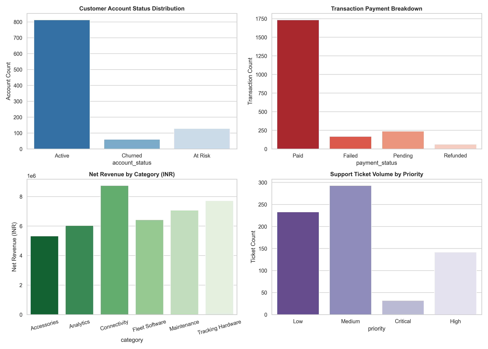
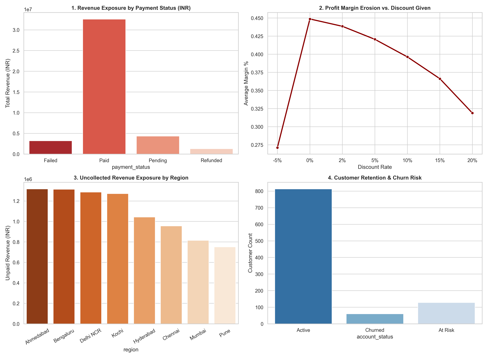

# OrionFleet Logistics - Business Analytics & Profit Leakage Project

This repository contains data analysis for the OrionFleet Logistics case study. The goal of this project is to go beyond basic summary stats and pinpoint where the company is losing revenue, why customer churn is happening, and how to improve profit margins.

---

## Executive Dashboards & Key Insights

### Executive Dashboard


### Profit Leakage Analysis


---

## Project Structure

* `customers.csv`, `transactions.csv`, `products.csv` - Operational datasets provided in the brief
* `support_tickets.csv`, `employees.csv`, `marketing_activity.csv` - Additional context datasets
* `main.py` - Core Python analysis script that calculates financial metrics and exports summary charts
* `app.py` - Interactive Streamlit dashboard for real-time data filtering
* `executive_dashboard.png` - High-level summary visual for business leadership
* `profit_leakage_dashboard.png` - Visual breakdown of revenue loss, operational inefficiencies, and churn drivers

---

## How to Run the Scripts

### 1. Requirements
Ensure you have Python installed, then install the required libraries:

```bash
pip install pandas matplotlib seaborn streamlit plotly
